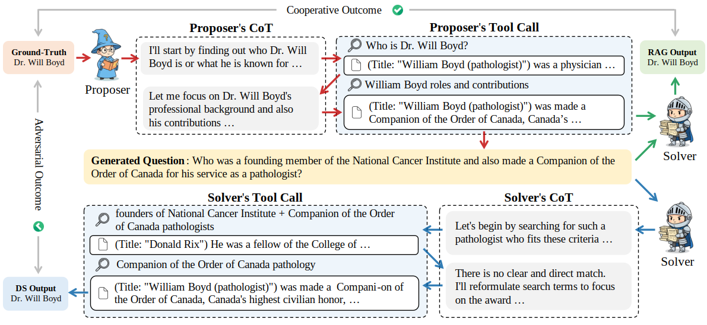
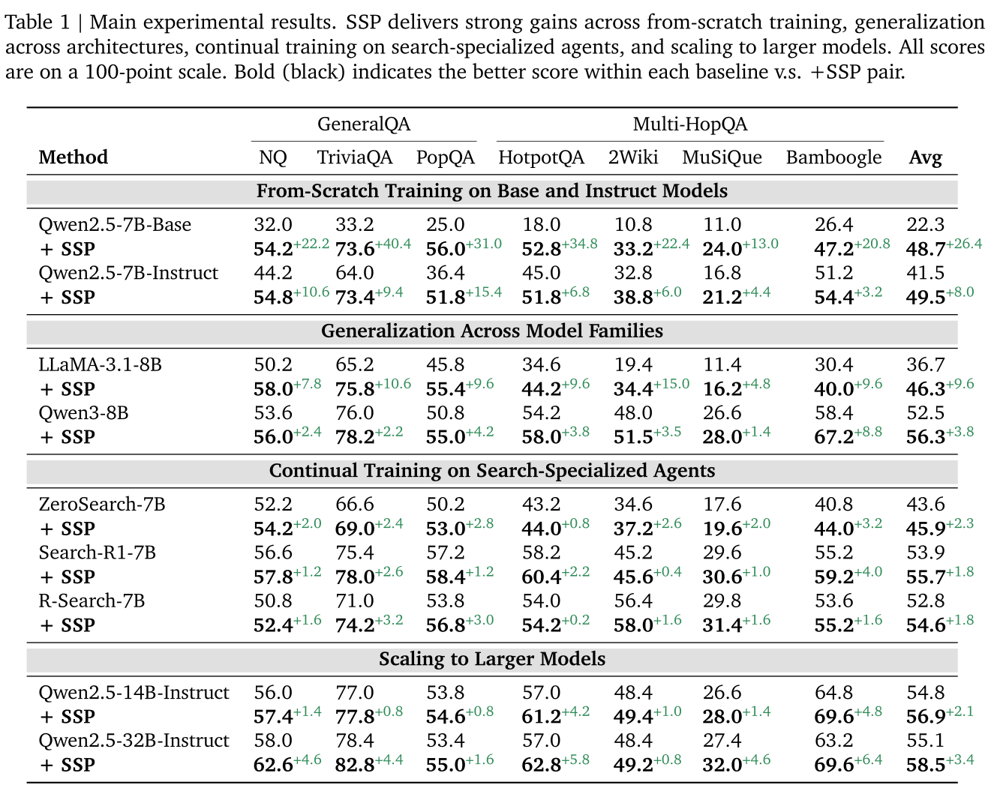

<h1 align="center">Search Self-Play: Pushing the Frontier of Agent Capability without Supervision </h1>

<p align="center">
  <a href='http://arxiv.org/abs/2510.18821'></a>
  <a href='https://huggingface.co/collections'></a>
  <a href='https://huggingface.co/datasets/Quark-LLM/SSP'></a>
  <a href="https://opensource.org/licenses/Apache-2.0"></a>
</p>

<p align="center">
  <i><b>Quark LLM Team , Alibaba Group</b></i>
</p>

**Search Self-Play (SSP)** is a reinforcement learning framework designed for training **adversarial self-play agents with integrated search capabilities**—enabling both proposer and solver agents to conduct multi-turn search engine calling and reasoning in a coordinated manner.

<p align="center">
  
</p>

Built upon [veRL](https://github.com/volcengine/verl) and [Search-R1](https://github.com/PeterGriffinJin/Search-R1), SSP extends the traditional self-play paradigm by incorporating tool-augmented reasoning capabilities. Both the **proposer** (generating challenging problems) and the **solver** (answering questions) can leverage search engines to access external knowledge during their multi-turn reasoning process.

Through RL training with rule-based outcome rewards, SSP enables two roles to **co-evolve** in an adversarial competition: the proposer learns to generate increasingly challenging problems that require search and reasoning, while the solver develops stronger search and reasoning capabilities to tackle these problems. The framework supports **different RL algorithms for each role** (e.g., PPO, GRPO, REINFORCE), allowing flexible optimization strategies tailored to each agent's learning dynamics.

# 🔥 News

- **[2025.10.24]** We released the SSP codebase.
- **[2025.10.22]** Released our paper on arXiv: [2510.18821](https://arxiv.org/abs/2510.18821).

# 💡 Main Results

SSP demonstrates significant improvements on QA tasks across different training settings through pure self-play, without requiring any human-annotated question-answer pairs!

<p align="center">
  
</p>

# 🛠️ Installation

1. **Create Conda Environment**

```bash
conda create -n ssp python=3.10 -y
conda activate ssp
```

2. **Clone SSP Repository**

```bash
git clone https://github.com/Alibaba-Quark/SSP.git
cd SSP
export PYTHONPATH=$PYTHONPATH:$(pwd)
```

3. **Install VeRL**

```bash
# Clone and install VeRL
git clone https://github.com/volcengine/verl
cd verl
git checkout cb809d66e46dfd3342d008628891a14a054fa424 # verified commit
pip install -e .
cd ..
```

4. **Install Dependencies**

```bash
# Configure pip source
pip3 config set global.index-url https://mirrors.aliyun.com/pypi/simple
pip3 config set install.trusted-host mirrors.aliyun.com

# Install required packages
pip3 install tensorboardX qwen_vl_utils
pip3 install transformers==4.55.0
pip3 install sglang==0.4.6.post5 sgl_kernel==0.1.5 cuda-python cuda-bindings torch_memory_saver torchao
pip3 install "pyarrow>=19.0.1"
pip3 install "optree>=0.13.0"
pip3 install torchdata math_verify==0.8.0
```

# ⚙️ Configuration

## Setup Services

### 1. LLM-as-a-Judge Service

Start the judge model server for evaluating generated problems:

```bash
cd ./examples/sglang_multiturn/search_r1_like
bash start_server_multinode.sh
```

This will start a judge model service at `http://{judge_host}:5000/v1`.

### 2. Local Dense Retriever Service

Set up the retrieval service for search capabilities:

```bash
cd ./examples/sglang_multiturn/search_r1_like/local_dense_retriever

# Download embedding model
pip install huggingface_hub[cli]
huggingface-cli download --resume-download intfloat/e5-base-v2 --local-dir intfloat/e5-base-v2

# Import FAISS lib
python import_faiss.py

# Configure retriever
export retriever_name=e5
export index_file=/path/to/e5_Flat
export corpus_file=/path/to/wiki-18
export retriever_path=intfloat/e5-base-v2

# Start retrieval server
PYTHONUNBUFFERED=1 nohup python retrieval_server.py \
    --index_path ${index_file}.index \
    --corpus_path ${corpus_file}.jsonl \
    --topk 3 \
    --retriever_name $retriever_name \
    --retriever_model $retriever_path \
    --faiss_gpu > retrieval.log 2>&1 &
```

The retrieval service will run at `http://{search_ip}:8000`.

# 🎯 Quick Start

## Data Preparation

Unlike supervised learning approaches, SSP **does not require question-answer pairs**. Instead, it only needs proposer prompts that guide the problem generation. The proposer generates problems based on these prompts, and the solver attempts to answer them. Through self-play, both agents improve without any ground-truth QA pairs.

The given ground-truth list with prompts used in training and the QA pairs used in evaluation are available in our [Hugging Face Dataset](https://huggingface.co/datasets/Quark-LLM/SSP).

- After downloading the training data, run the preprocessing script:

  ```bash
  python examples/data_preprocess/preprocess_ssp_train_dataset.py --input /path/to/jsonl --output /path/to/processed_jsonl
  ```

  This will format the training data into the required structure for SSP training.

- There is no need to preprocess evaluation data, as it is already in the required format. Just provide the path to it in the training script. For customization, please refer to `examples/data_preprocess/preprocess_ssp_eval_dataset.py` to see how to format the test data.

## Configure Training Script

Before training, edit the configuration section at the beginning of `examples/train_ssp.sh` script to modify the following configurations:

**Required Configuration:**

```bash
# Model checkpoint paths
export SOURCE_ACTOR_CHECKPOINT_DIR=/path/to/actor/checkpoint
export SOURCE_ACTOR_CHECKPOINT_ITERATION_DIRNAME=checkpoint_name
export SOURCE_REWARD_CHECKPOINT_DIR=/path/to/reward/checkpoint  # Optional if reward model disabled
export SOURCE_REWARD_CHECKPOINT_ITERATION_DIRNAME=checkpoint_name
export SOURCE_CRITIC_CHECKPOINT_DIR=/path/to/critic/checkpoint
export SOURCE_CRITIC_CHECKPOINT_ITERATION_DIRNAME=checkpoint_name

# Data paths (space-separated for multiple files)
export DATA_PATH="/path/to/train_data1 /path/to/train_data2"
export TEST_DATA_PATH="/path/to/test_data1 /path/to/test_data2"

# Output paths
export OUTPUT_DIR=/path/to/output
export SAVE_CHECKPOINT_DIR=/path/to/save/checkpoints
export TENSORBOARD_LOG_DIR=/path/to/tensorboard/logs

# Judge and Search service settings
export QUARK_BASE_URL=http://judge_host:5000/v1  # LLM-as-a-Judge service URL
export QUARK_MODEL=judge_model_name              # Judge model name
export QUARK_SEARCH_CHAT_TEMPLATE=default        # Chat template: default, qwen2p5, R-Search, llama3p1
export SEARCH_IP=search_service_ip               # Retrieval service IP address
```

**Distributed Training Configuration:**

For multi-node distributed training, you can set these via environment variables before running the script, or use the default values in the script:

```bash
# Distributed training settings
export NNODES=1  # Number of nodes (default: 1)
export RANK=0    # Current node rank, 0 for master (default: 0)
export MASTER_ADDR=localhost  # Master node address (default: localhost)
```

**Key hyperparameters in `train_ssp.sh`:**

```bash
# Batch settings
BATCH_SIZE=256
MINI_BATCH_SIZE=128
ROLLOUT_N=5  # Number of rollouts per prompt (for GRPO)

# Sequence length
MAX_PROMPT_LENGTH=4096
MAX_RESPONSE_LENGTH=8192

# Model parallelism
ROLLOUT_TP=4  # Tensor parallelism for rollout
ACTOR_FSDP_SIZE=-1  # FSDP size (-1 for auto)

# Training method
TRAIN_METHOD=grpo

# Self-play settings
SELF_PLAY_ENABLE=True
PROPOSER_N=1  # Number of problem generation attempts
PROPOSER_REWARD_TYPE=1-acc  # Reward type: "1-acc" or "intermediate_difficulty"
SOLVER_ENABLE=True

# Validation
TOTAL_EPOCHS=10
VAL_N=1  # Number of validation samples
VAL_TEMPERATURE=0.0
```

## Single-Node Training

After configuring the script, simply run:

```bash
bash examples/train_ssp.sh
```

The script will use the configurations you set in the script header, including:

- Judge service URL and model name
- Chat template (options: `default`, `qwen2p5`, `R-Search`, `llama3p1`)
- Retrieval service IP address
- Model checkpoint paths
- Data paths and output directories

## Multi-Node Training

After configuring the script, run the following on each node:

On **master node** (RANK=0):

```bash
export NNODES=4
export RANK=0
export MASTER_ADDR=master_node_ip

bash examples/train_ssp.sh
```

On **worker nodes** (RANK=1,2,3,...):

```bash
export NNODES=4
export RANK=1  # Change to 2, 3, ... for other workers
export MASTER_ADDR=master_node_ip

bash examples/train_ssp.sh
```

> **Note**: Ensure all nodes have the same configuration in the `train_ssp.sh` script.

# 🙏🏻 Acknowledgements

This project builds on [Search-R1](https://github.com/PeterGriffinJin/Search-R1) and [veRL](https://github.com/volcengine/verl) . We thank the original authors for their open-source contributions.

# ⭐️ Citation

If you find this work useful, please kindly cite:

```bibtex
@article{lu2025searchselfplay,
  title={Search Self-play: Pushing the Frontier of Agent Capability without Supervision},
  author={Lu, Hongliang and Wen, Yuhang and Cheng, Pengyu and Ding, Ruijin and Xu, Haotian and Guo, Jiaqi and Wang, Chutian and Chen, Haonan and Jiang, Xiaoxi and Jiang, Guanjun},
  journal={arXiv preprint arXiv:2510.18821},
  year={2025}
}
```
